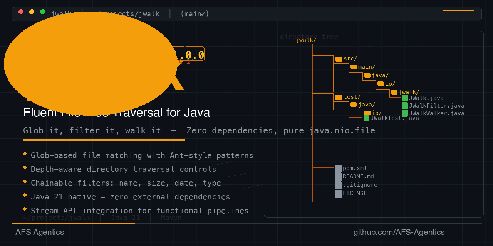

# jwalk

**Fluent file tree traversal for Java** — glob it, filter it, walk it.

[](LICENSE)
[](https://openjdk.org/projects/jdk/21/)

**jwalk** is a lightweight, zero-dependency Java library for recursive directory traversal with a fluent API. Walk directory trees with glob/regex filtering, depth control, symlink handling, error recovery, and optional parallel walking.

---

## Features

- ✅ **Glob pattern filtering** — `Walk.over(dir).glob("*.txt")`
- ✅ **Regex pattern filtering** — `Walk.over(dir).regex(".*\\.java$")`
- ✅ **Depth control** — `maxDepth(3)` for shallow walks
- ✅ **Symlink handling** — `followSymlinks(true/false)`
- ✅ **Parallel walking** — `parallel(4)` for large directory trees
- ✅ **Error recovery** — handle permission errors gracefully
- ✅ **Multiple terminal ops** — `walk()`, `forEach()`, `toList()`, `toStream()`
- ✅ **Event handler API** — lifecycle callbacks (`onStart`, `onFile`, `onDirectory`, `onError`, `onEnd`)
- ✅ **Zero external dependencies** — pure `java.nio.file` API
- ✅ **Java 21+** — records, pattern matching, sealed-free

---

## Installation

### Maven

```xml
<dependency>
    <groupId>com.afs</groupId>
    <artifactId>jwalk</artifactId>
    <version>0.1.0</version>
</dependency>
```

### Gradle

```groovy
implementation 'com.afs:jwalk:0.1.0'
```

### Manual

Download the JAR from [releases](https://github.com/AFS-Agentics/jwalk/releases) and add it to your classpath.

---

## Quick Start

```java
import com.afs.jwalk.Walk;
import com.afs.jwalk.WalkResult;

// List all .txt files in a directory
Walk.over("/path/to/dir")
    .glob("*.txt")
    .forEach(System.out::println);

// Walk with depth limit and collect results
WalkResult result = Walk.over("/path")
    .maxDepth(3)
    .regex(".*\\.java$")
    .walk();

System.out.println(result.summary());
// Output: "Walked 45 paths, matched 12, 0 errors in 23 ms"
```

---

## API Reference

### Entry Points

| Method | Description |
|--------|-------------|
| `Walk.over(String path)` | Start a walk over the given path string |
| `Walk.over(Path path)` | Start a walk over the given `Path` |

### Configuration

| Method | Default | Description |
|--------|---------|-------------|
| `.glob(String pattern)` | — | Add a glob filter (file-system syntax, matched against filename) |
| `.regex(String pattern)` | — | Add a regex filter (matched against full path) |
| `.maxDepth(int depth)` | `Integer.MAX_VALUE` | Maximum directory depth to descend |
| `.followSymlinks(boolean)` | `false` | Whether to follow symbolic links |
| `.includeDirs(boolean)` | `false` | Whether to include directories in results |
| `.parallel(int threads)` | `0` (sequential) | Use parallel walking with the given thread count |
| `.onError(Consumer<IOException>)` | no-op | Error handler for I/O exceptions |

Multiple `.glob()` and `.regex()` calls combine as **intersection** (AND) — all filters must match.

### Terminal Operations

| Method | Returns | Description |
|--------|---------|-------------|
| `.walk()` | `WalkResult` | Execute the walk and return result |
| `.walk(WalkEventHandler)` | `WalkResult` | Execute with lifecycle callbacks |
| `.forEach(Consumer<Path>)` | `WalkResult` | Execute and apply action to each match |
| `.toList()` | `List<Path>` | Execute and collect matches |
| `.toStream()` | `Stream<Path>` | Execute and stream matches |

### WalkResult

| Method | Returns | Description |
|--------|---------|-------------|
| `.matchedPaths()` | `List<Path>` | Unmodifiable list of matched paths |
| `.matchCount()` | `int` | Number of matched paths |
| `.totalCount()` | `long` | Total files/dirs visited |
| `.errorCount()` | `long` | I/O errors encountered |
| `.elapsedTime()` | `Duration` | Wall-clock duration |
| `.isClean()` | `boolean` | `true` if no errors occurred |
| `.summary()` | `String` | Human-readable summary |

### WalkEventHandler

```java
Walk.over("/path").walk(new WalkEventHandler() {
    @Override
    public void onStart() { /* walk started */ }

    @Override
    public void onFile(Path file) { /* file visited */ }

    @Override
    public void onDirectory(Path dir, boolean isRoot) { /* directory visited */ }

    @Override
    public void onError(IOException ex) { /* error occurred */ }

    @Override
    public void onEnd(WalkResult result) { /* walk finished */ }
});
```

---

## Examples

### Find all Java files excluding test files

```java
List<Path> sources = Walk.over("./src")
    .glob("*.java")
    .regex("^(?!.*Test).*$")
    .toList();
```

### Safe walk with error handling

```java
WalkResult result = Walk.over("/root")
    .maxDepth(2)
    .onError(ex -> System.err.println("Skipping: " + ex.getMessage()))
    .walk();

if (!result.isClean()) {
    System.err.println("Encountered " + result.errorCount() + " errors");
}
```

### Parallel walk with event callbacks

```java
Walk.over("/data")
    .glob("*.log")
    .parallel(4)
    .walk(new WalkEventHandler() {
        public void onFile(Path file) {
            System.out.println("Processing: " + file);
        }
        public void onError(IOException ex) {
            System.err.println("Error: " + ex.getMessage());
        }
    });
```

---

## Building from Source

```bash
git clone https://github.com/AFS-Agentics/jwalk.git
cd jwalk
mvn package
```

Requires Java 21+ and Maven 3.9+.

### Running Tests

```bash
mvn test
```

The test suite includes **104 tests** covering:

- Core walking functionality (sequential + parallel)
- Glob and regex filtering edge cases
- Depth control (0, limited, unlimited)
- Symlink loop detection
- Unicode/emoji filenames
- Permission-denied error handling
- Deep directory trees (100+ levels)
- Large file counts (1000+ files)
- Thread safety in parallel mode
- Event handler lifecycle
- WalkResult correctness
- Null and empty input validation

---

## License

MIT © 2026 [Shahrukh Yousafzai](https://github.com/ShahrukhYousafzai)

See [LICENSE](LICENSE) for details.
